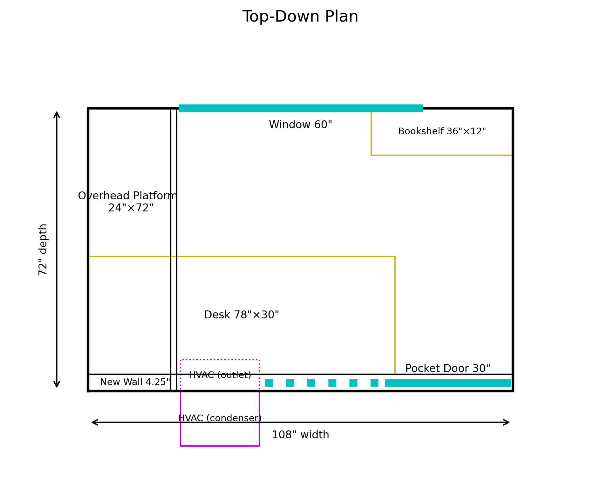
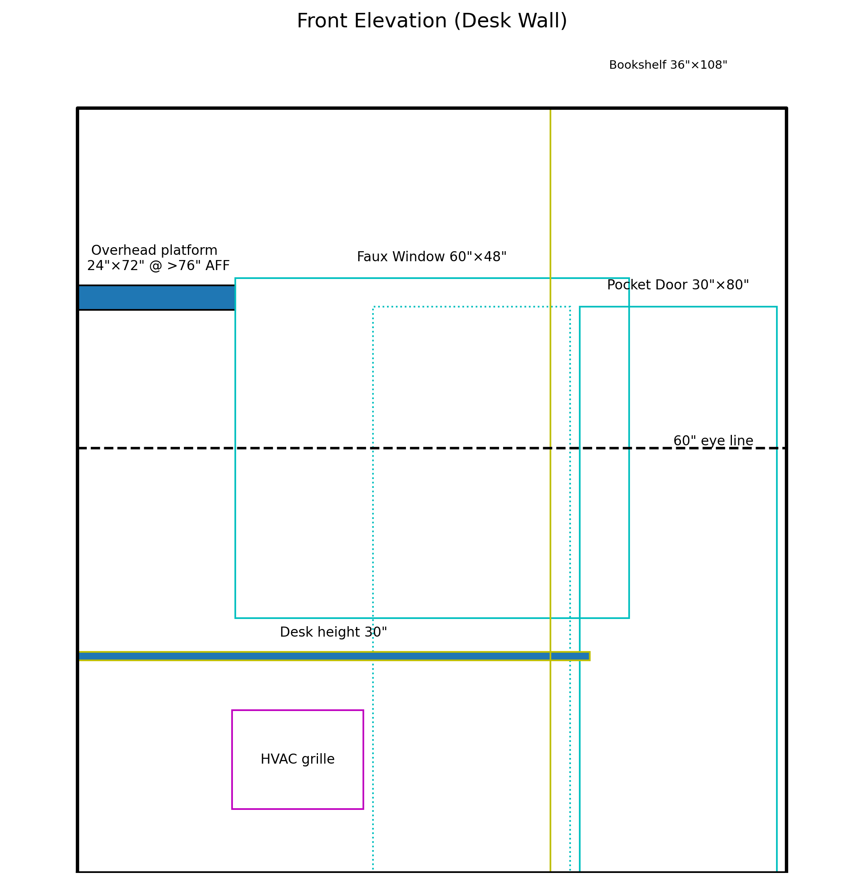

# Garage Office Layout

Compact 9'×6' garage inset converted into a focus nook with a pocket door, full-height bookshelf, and concealed HVAC.

## Visuals




## Regenerating Diagrams

Layout dimensions live in `layout.yaml`. Update the values there (widths, heights, offsets) and re-render with:

```bash
python3 projects/garage-office/garage-office.py --config projects/garage-office/layout.yaml --no-show --output-dir projects/garage-office/renders
```

## Space Overview

- Interior clear area is **108" wide × 72" deep × 108" high**, giving just enough room for a 6.5' desk plus circulation.
- A new **pocket-door wall** defines the office boundary and hides the door kit inside a double-stud chase; the opening sits 1.5" off the right corner for trim reveal.
- Opposite the door, a centered **60" window** keeps symmetry and lines up with the desk datum for balanced daylight.

## Desk Wall & Platform

- The built-in desk spans **78" × 30"** tight to the new wall, with a **24" deep overhead platform** perched at **76" AFF** for bins and lighting strips.
- Eye-sight reference at **60"** ensures artwork or monitors stay below the platform cross beam.
- Under-desk HVAC protrudes **8" into the office** (20" wide grille) and another **14" into the garage**, keeping the condenser accessible while blocking glare with the desk apron.

## Entry & Storage

- The first view through the pocket door lands on a **36" × 12" bookshelf** along the north wall, stretching the full wall height for visual drama and storage.
- Circulation path remains 30"+, running from the pocket door to the window with the desk hugging the south wall.
- The overhead platform’s stud bay doubles as a lighting raceway above the pocket door header.

## Environmental Notes

- Desk sits just inside the wall thickness to leave room for outlets, HVAC penetrations, and a 4.25" service chase.
- Faux window casing can frame acoustic panels, while the HVAC condenser sill gets a reflective tray to protect the garage face.
- Keep finish palette warm (wood desk, muted shelving) so the narrow footprint doesn’t feel like a closet; integrate diffused task lighting under the platform to wash the work surface.
